# Онлайн-магазин с использованием микросервисной архитектуры

## О проекте

Проект разрабатывался в ходе курса по микросервисной архитектуре. Начиная с сервиса управления пользователями, система была постепенно расширена до интернет-магазина с заказами, оплатой, резервированием товара и доставки, уведомлениями и обработкой ошибок распределенного процесса.

Пользователь регистрируется, входит в систему, пополняет счет и создает заказ. Во время оформления заказа система должна:

1. провести платеж;
2. зарезервировать товар;
3. зарезервировать курьера на выбранный временной слот;
4. сохранить уведомление о результате оформления.

Если один из этапов завершается ошибкой, ранее выполненные операции компенсируются.

## Развитие проекта

| Этап                                                    | Реализовано                                                                                                                                                  |
|---------------------------------------------------------|--------------------------------------------------------------------------------------------------------------------------------------------------------------|
| [Домашнее задание 04](../homework-04/README.md)         | REST API для управления пользователями, PostgreSQL, Docker, Kubernetes, Ingress, Helm и Postman-тесты                                                        |
| [Домашнее задание 05](../homework-05/README.md)         | Prometheus-метрики, Grafana, алерты и нагрузочное тестирование с помощью k6                                                                                  |
| [Домашнее задание 06](../homework-06/README.md)         | Регистрация, аутентификация, серверные сессии, авторизация через nginx `auth_request` и разграничение доступа к данным пользователей                         |
| [Домашнее задание 07](../homework-07/README.md)         | Разделение приложения на User, Billing, Order и Notification Service, отдельные базы данных, взаимодействие через HTTP и Kafka, контракты OpenAPI и AsyncAPI |
| [Домашние задания 08 и 09](../homework-08-09/README.md) | Warehouse и Delivery Service, оркестрируемая Saga, Transactional Outbox, компенсации, семантические блокировки и идемпотентность HTTP API и Kafka-операций   |

## Состав системы

| Компонент                | Назначение                                                                          |
|--------------------------|-------------------------------------------------------------------------------------|
| User Service             | Хранение пользователей и серверных сессий, регистрация, вход и проверка авторизации |
| Billing Service          | Управление счетами, пополнение баланса, проведение и возврат платежей               |
| Order Service            | Создание заказов, хранение состояния и оркестрация Saga                             |
| Warehouse Service        | Резервирование и освобождение товара                                                |
| Delivery Service         | Резервирование курьера на временной слот                                            |
| Notification Service     | Сохранение уведомлений о результате оформления заказа                               |
| Kafka                    | Передача команд и результатов этапов Saga                                           |
| PostgreSQL               | Отдельное хранилище данных для каждого сервиса                                      |
| NGINX Ingress Controller | Маршрутизация входящих запросов и проверка пользовательской сессии                  |

Сервисы написаны на Go и имеют отдельные Go-модули, Docker-образы и базы данных. Прикладные сервисы запускаются в двух репликах. Реплики Kafka consumers одного сервиса входят в общую consumer group.

## Архитектура

Текущая схема представляет контейнерный уровень C4 с отдельными элементами развертывания в Kubernetes.



Исходный файл диаграммы: [architecture.mmd](../homework-08-09/docs/architecture.mmd).

### Оформление заказа

Order Service является оркестратором Saga. Он хранит состояние процесса в PostgreSQL и отправляет команды участникам через Kafka.


Исходный файл диаграммы: [sequence-http-kafka.mmd](../homework-08-09/docs/sequence-http-kafka.mmd).

| Шаг | Сервис               | Операция                                        | Компенсация                                                |
|----:|----------------------|-------------------------------------------------|------------------------------------------------------------|
|   1 | Order Service        | Создание заказа и команды на проведение платежа | Перевод заказа в состояние `failed`                        |
|   2 | Billing Service      | Проведение платежа                              | Возврат платежа                                            |
|   3 | Warehouse Service    | Резервирование товара                           | Освобождение товара                                        |
|   4 | Delivery Service     | Резервирование курьера и временного слота       | Не предусмотрена, операция является поворотной точкой Saga |
|   5 | Order Service        | Завершение заказа                               | Не требуется                                               |
|   6 | Notification Service | Сохранение уведомления                          | Не требуется                                               |

При ошибке Billing заказ завершается без компенсаций. При ошибке Warehouse возвращается платеж. При ошибке Delivery сначала освобождается товар, после чего возвращается платеж.

Резервирование товара защищено уникальным ограничением на активный `productId`. Для доставки действует уникальное ограничение на активную пару `courierId` и `deliverySlot`. Ограничения не позволяют двум заказам одновременно использовать один ресурс.

## Надежность обмена сообщениями

Kafka используется с семантикой доставки `at-least-once`. Повторная доставка сообщения считается штатной ситуацией и не должна приводить к повторному выполнению бизнес-операции.

Для атомарной записи бизнес-изменения и исходящего сообщения применяется Transactional Outbox. Запись данных и сообщения в `outbox_messages` выполняется в одной транзакции PostgreSQL. Фоновый обработчик публикует сохраненные сообщения в Kafka.

Идемпотентность участников Saga обеспечивается идентификаторами операций:

* Billing Service сохраняет `operationId` и не проводит повторное списание или возврат;
* Warehouse Service сохраняет `operationId` для резервирования и освобождения товара;
* Delivery Service сохраняет `operationId` операции резервирования;
* Notification Service использует `eventId` как первичный ключ и выполняет вставку через `ON CONFLICT DO NOTHING`;
* Order Service применяет результат этапа только к ожидаемому состоянию заказа под блокировкой строки.

Kafka key для команд и результатов равен `orderId`. Благодаря этому сообщения одного заказа попадают в одну партицию и обрабатываются последовательно.

## Идемпотентность создания заказа

Метод `POST /api/v1/orders` требует заголовок `Idempotency-Key`.

Order Service хранит ключи в отдельной таблице. Составной первичный ключ образован полями `user_id` и `key`. Вместе с ключом сохраняются SHA-256-хеш запроса, идентификатор заказа и время создания.

Ключ, заказ и первая Outbox-команда создаются одной транзакцией PostgreSQL. При двух параллельных запросах с одинаковым ключом уникальное ограничение сериализует вставку:

* если первая транзакция завершилась успешно, второй запрос возвращает связанный с ключом заказ;
* если хеш запроса отличается, возвращается `409 Conflict`;
* если первая транзакция откатилась, второй запрос может создать ключ и заказ.

Ключи не имеют срока жизни. Это исключает повторное создание уже оформленного заказа после автоматического удаления ключа. Текущее состояние операции определяется через связанный заказ. Для промышленной эксплуатации срок хранения можно добавить, но удалять ключ следует только после перехода заказа в конечное состояние и завершения установленного периода хранения.

## Аутентификация и авторизация

После входа User Service создает серверную сессию и возвращает cookie `session_id`. Сессия хранится в PostgreSQL и доступна всем репликам сервиса.

Для защищенных маршрутов NGINX Ingress вызывает `GET /auth`. После успешной проверки он передает сервисам заголовки `X-Auth-UserId`, `X-Auth-Email` и `X-Auth-Roles`. Пользователь получает доступ только к собственным данным, а административные методы дополнительно проверяют роль.

## Контракты

Синхронные HTTP API описаны в OpenAPI:

* [User Service](../homework-08-09/services/user-service/docs/swagger.yaml);
* [Billing Service](../homework-08-09/services/billing-service/docs/swagger.yaml);
* [Order Service](../homework-08-09/services/order-service/docs/swagger.yaml);
* [Notification Service](../homework-08-09/services/notification-service/docs/swagger.yaml).

Warehouse и Delivery Service получают команды только через Kafka. Асинхронные команды и события описаны в [AsyncAPI](../homework-08-09/docs/asyncapi.yaml).

## Технологии

* Go, Gin, GORM, pgx;
* kafka-go;
* Viper;
* Zap;
* Prometheus Client;
* Validator;
* Testify и GoMock;
* PostgreSQL;
* Apache Kafka;
* Docker;
* Kubernetes и Helm;
* NGINX Ingress Controller;
* Prometheus, Grafana, Loki и Alloy;
* OpenAPI и AsyncAPI;
* Postman, Newman и k6.

## Наблюдаемость

Сервисы публикуют технические и бизнес-метрики для Prometheus. В Helm chart добавлены ServiceMonitor, Grafana dashboards и правила алертинга.

Структурированные логи записываются с помощью Zap и собираются Alloy в Loki. HTTP-запрос получает `X-Request-ID`, по которому можно найти связанные записи в Grafana.

Kafka UI используется для просмотра топиков, сообщений и consumer groups.

## Установка

Для локального стенда используется Minikube:

```powershell
minikube start --cpus=6 --memory=8192
```

Установка приложения выполняется из каталога Helm chart:

```powershell
cd ../homework-08-09/deployment/helm/online-store

helm dependency build .

helm upgrade --install online-store . `
  -n online-store `
  --create-namespace `
  --timeout 15m `
  --wait `
  --wait-for-jobs
```

Подробная установка Prometheus, Grafana, Loki и Alloy приведена в [README домашних заданий 08 и 09](../homework-08-09/README.md#работа-с-helm).

Для обращения к приложению используется домен `arch.homework`. При использовании Docker driver для Minikube необходимо запустить:

```powershell
minikube tunnel
```

## Тестирование

Модульные тесты:

```powershell
cd ../homework-08-09

go test ./services/user-service/... `
  ./services/billing-service/... `
  ./services/order-service/... `
  ./services/warehouse-service/... `
  ./services/delivery-service/... `
  ./services/notification-service/... `
  ./internal/platform/...
```

Интеграционный сценарий:

```powershell
cd ../homework-08-09

newman run tests/OTUS-homework-08-09.postman_collection.json `
  --reporters cli `
  --verbose `
  --bail
```

Postman-коллекция проверяет:

* успешное оформление заказа;
* повтор запроса с тем же ключом идемпотентности;
* конфликт при изменении запроса для существующего ключа;
* недостаток средств;
* ошибку резервирования товара и возврат платежа;
* ошибку резервирования доставки, освобождение товара и возврат платежа;
* создание уведомления для каждого результата Saga;
* итоговый баланс и отсутствие повторных бизнес-операций.

## Порядок демонстрации

1. Зарегистрировать пользователя и войти в систему.
2. Пополнить счет в Billing Service.
3. Создать заказ и дождаться состояния `completed`.
4. Повторить запрос с тем же `Idempotency-Key` и показать, что новый заказ и платеж не появились.
5. Отправить измененный запрос с тем же ключом и получить `409 Conflict`.
6. Выполнить сценарии отказа Billing, Warehouse и Delivery.
7. Проверить компенсации и уведомления.
8. Показать топики и consumer groups в Kafka UI.
9. Показать метрики и логи в Grafana.

## Ограничения учебного стенда

* Kafka развернута в одном экземпляре и не образует отказоустойчивый кластер.
* Доставка Kafka-сообщений имеет семантику `at-least-once`, гарантия exactly-once не заявляется.
* Dead Letter Queue не реализована.
* Ключи идемпотентности не очищаются автоматически.
* Notification Service сохраняет email-сообщения в базе данных, но не отправляет их через внешний почтовый сервис.
* Warehouse и Delivery используют строковые идентификаторы ресурсов вместо полноценных каталогов товаров, курьеров и расписаний.
