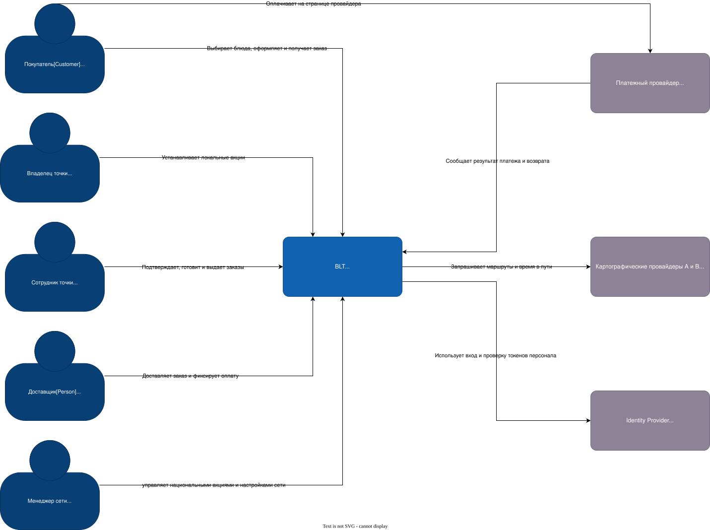

# C4 System Context

На схеме показано, кто работает с BLT и к каким внешним системам она обращается. Внутреннее устройство вынесено на контейнерную диаграмму.

Заказы по факсу сотрудник переносит в BLT вручную. Для входа персонала выбран внешний Identity Provider. Это допущение: в самой кате способ входа не описан. Покупатель может оформить заказ без регистрации.
