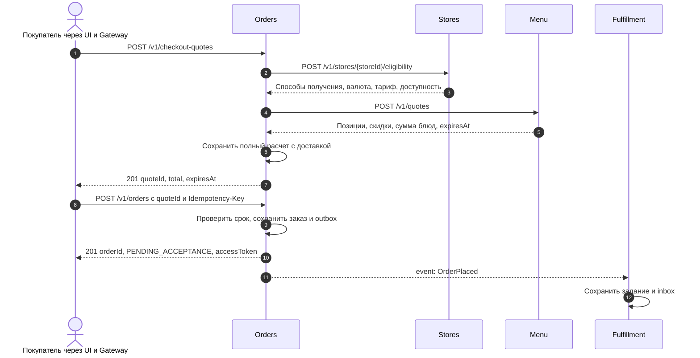
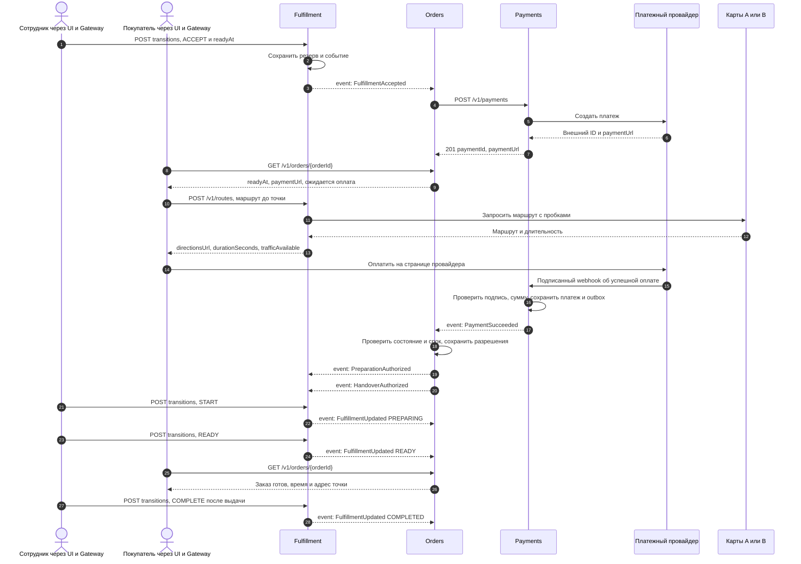
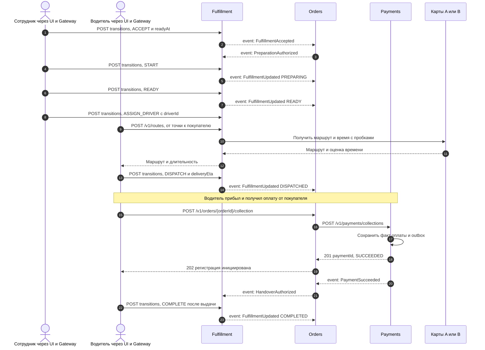
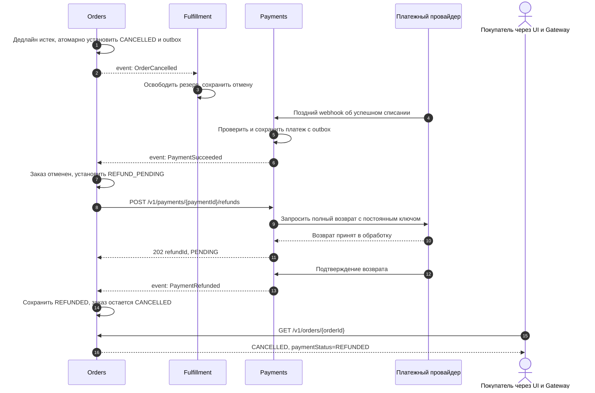

# Диаграммы процессов

[К решению](../README.md) / [Контейнеры](containers.md) / [Контракты](contracts.md)

На этих диаграммах разобраны основные сценарии из задания. Чтобы схемы не были слишком широкими, UI и Gateway указаны в подписи пользователя, а базы и брокер отдельно не показаны. Сообщения с пометкой `event:` проходят через брокер с outbox/inbox. Сплошные стрелки - запросы и действия, пунктирные - ответы и события. Стрелка к самому сервису означает локальную проверку или запись данных.

## PV-01. Расчет и создание заказа - UC-01, UC-02, UC-03

Показан успешный расчет. Недоступная доставка или блюдо возвращают бизнес-ошибку без создания заказа; просроченный расчет требует нового подтверждения цены. Ответ `201` означает сохранение заказа, а не согласие кухни. Подтверждение точки показано в следующих процессах. Повтор команды с тем же ключом не создает второй заказ.

## PV-02. Онлайн-оплата и самовывоз - UC-02, UC-04, UC-06, UC-09

К этому моменту заказ уже создан по сценарию PV-01 и попал в очередь точки.

Здесь оплата обработана до окончания резерва. При отказе точки `FulfillmentRejected` завершает процесс без создания платежа. При ошибке карт сохраняются адрес и время готовности; оплата и приготовление продолжаются. Переход `COMPLETE` проверяет готовность и наличие `HandoverAuthorized`. Возврат браузера со страницы оплаты не используется как подтверждение списания.

## PV-03. Доставка с оплатой при получении - UC-03, UC-05, UC-06

Заказ создан с `fulfillmentType=DELIVERY` и `paymentMethod=COD`. Адрес доставки проверен при оформлении в PV-01.

Оплата при получении не вызывает онлайн-платежного провайдера: Payments учитывает факт, зарегистрированный водителем с нужными правами. Приготовление разрешено ранее, поэтому повторное разрешение приготовления по `PaymentSucceeded` не требуется. Если событие оплаты еще не доставлено, `COMPLETE` возвращает конфликт состояния; интерфейс обновляет задание и позволяет повторить действие после разрешения. Без водителя отправка невозможна, сотрудник уточняет время или фиксирует невозможность исполнения через `FAIL`.

## PV-04. Истечение резерва и поздняя оплата - альтернатива UC-04

Точка уже приняла заказ и платеж создан, но Orders еще не получил подтверждение оплаты.

Статус заказа и статус оплаты раздельны. До подтверждения возврата отображается `REFUND_PENDING`; при временной ошибке возврат повторяется с тем же ключом. Если повторы не помогли, ошибку разбирает сотрудник. Если оплата не поступит, возврат не создается. Невозможность исполнения уже оплаченного заказа (`FulfillmentFailed`) приводит к той же компенсации.
