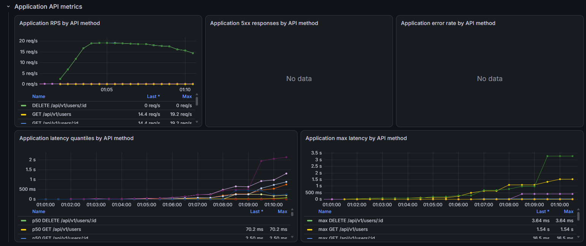
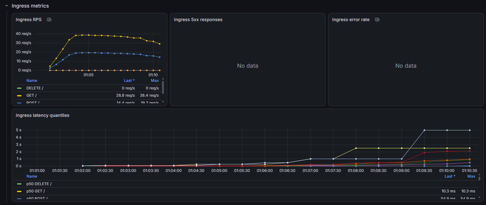
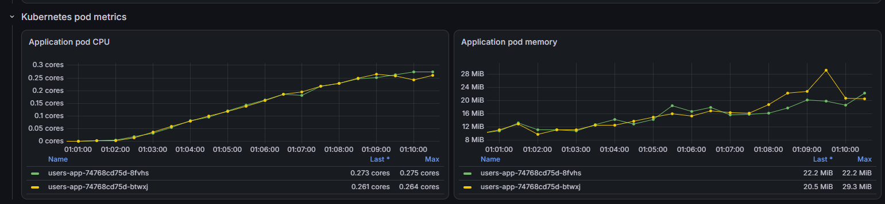
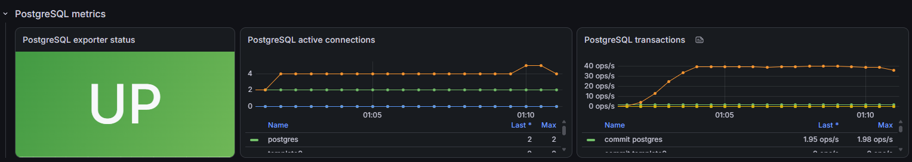

# otus-microservices-homework-06

RESTful CRUD with Helm для домашней работы на OTUS

## Architecture



Mermaid source: [architecture.mmd](./docs/architecture.mmd)


## Сборка и публикация
1. `docker build --platform linux/amd64 -t paulrozhkin/otus-microservices-homework-06:latest .` 
2. `docker push paulrozhkin/otus-microservices-homework-06:latest`
3. `docker run -p 8000:8000 paulrozhkin/otus-microservices-homework-06:latest`

## Minikube 
1. Запуска minikube с заданными ресурсами:
```
minikube start --cpus=6 --memory=8192
```

## Работа с helm
1. Переходим в helm дирректорию:
```aiignore
cd ./deployment/helm/users-service
```
2. Добавляем репозитории (bitnami из под VPN):
```aiignore
helm repo add bitnami https://charts.bitnami.com/bitnami
helm repo add ingress-nginx https://kubernetes.github.io/ingress-
helm repo add prometheus-community https://prometheus-community.github.io/helm-charts
helm repo update
```
3. Устанавливаем мониторинг:
```aiignore
helm upgrade --install kube-prometheus-stack prometheus-community/kube-prometheus-stack `
  -n monitoring `
  --create-namespace `
  --set prometheus.prometheusSpec.serviceMonitorSelectorNilUsesHelmValues=false `
  --set prometheus.prometheusSpec.podMonitorSelectorNilUsesHelmValues=false `
  --set grafana.adminPassword=admin `
  --set grafana.sidecar.alerts.enabled=true `
  --set grafana.sidecar.alerts.label=grafana_alert `
  --set grafana.sidecar.alerts.searchNamespace=monitoring `
  --set prometheus.prometheusSpec.retention=2h `
  --set prometheus.prometheusSpec.resources.requests.memory=512Mi `
  --set prometheus.prometheusSpec.resources.limits.memory=1Gi `
  --set grafana.resources.requests.memory=128Mi `
  --set grafana.resources.limits.memory=512Mi
```
4. Для доступа к стеку мониторинга следовать инструкциями из возврата предыдущей команды. 
    Нужно прокинуть доступ до Grafana через инструкции "Access Grafana local instance". Дубликат возврата:
```aiignore
Get Grafana 'admin' user password by running:

  kubectl --namespace monitoring get secrets kube-prometheus-stack-grafana -o jsonpath="{.data.admin-password}" | base64 -d ; echo

Access Grafana local instance:

  export POD_NAME=$(kubectl --namespace monitoring get pod -l "app.kubernetes.io/name=grafana,app.kubernetes.io/instance=kube-prometheus-stack" -oname)
  kubectl --namespace monitoring port-forward $POD_NAME 3000

Get your grafana admin user password by running:

  kubectl get secret --namespace monitoring -l app.kubernetes.io/component=admin-secret -o jsonpath="{.items[0].data.admin-password}" | base64 --decode ; echo


Visit https://github.com/prometheus-operator/kube-prometheus for instructions on how to create & configure Alertmanager and Prometheus instances using the Operator.
```
5. Подтягиваем зависимости и устанавливаем chart:
```aiignore
helm dependency build .

helm upgrade --install users-service . `
  -n users-service `
  --create-namespace `
  --wait
```
6. Если minikube запущен с driver=docker, то выполнить тунелирование:
```aiignore
minikube tunnel
```
7. Выполнить postman тест:
```aiignore
newman run ./../../../tests/OTUS-homework-6.postman_collection.json --reporters cli --verbose
```
8. Запустить нагрузочный тест:
```aiignore
k6 run ./../../../tests/load-test.js
```

## Stress test results

### API metrics



### Ingress metrics



### Kubernetes pod metrics



### PostgreSQL metrics


