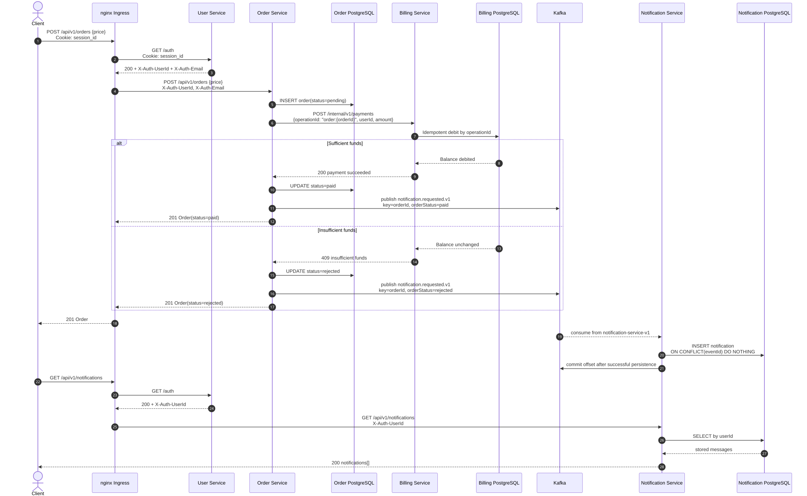

# otus-microservices-homework-07

## Задание

Реализовать сервис заказа. Сервис биллинга. Сервис нотификаций.

При создании пользователя необходимо создавать аккаунт в сервисе биллинга. В сервисе биллинга должна быть возможность положить деньги на аккаунт и снять деньги.

Сервис нотификаций позволяет отправить сообщение на email. И позволяет получить список сообщений по методу API.

Пользователь может создать заказ. У заказа есть параметр — цена заказа.

Заказ происходит в 2 этапа:

1. Сначала снимаем деньги с пользователя с помощью сервиса биллинга.
2. Отправляем пользователю сообщение на почту с результатами оформления заказа:

   * если биллинг подтвердил платеж, должно отправиться письмо счастья;
   * если нет — письмо горя.

Упрощаем и считаем, что ничего плохого с сервисами происходить не может (они не могут падать и т. д.).

Сервис нотификаций на самом деле не отправляет сообщения, а просто сохраняет их в БД.

---

### ТЕОРЕТИЧЕСКАЯ ЧАСТЬ

#### 0. Спроектировать взаимодействие сервисов при создании заказов

Предоставить варианты взаимодействий в следующих стилях в виде **sequence-диаграммы** с описанием API на **IDL**:

* только HTTP-взаимодействие;
* событийное взаимодействие с использованием брокера сообщений для нотификаций (уведомлений);
* Event Collaboration стиль взаимодействия с использованием брокера сообщений;
* вариант, который вам кажется наиболее адекватным для решения данной задачи.

Если он совпадает с одним из вариантов выше — просто отметить это.

---

### ПРАКТИЧЕСКАЯ ЧАСТЬ

Выбрать один из вариантов и реализовать его.

На выходе должны быть:

#### I) Описание архитектурного решения

Описание архитектурного решения и схема взаимодействия сервисов **в виде картинки**.

#### II) Команда установки приложения

Команда установки приложения:

* из Helm;
* или из манифестов.

Обязательно указать, в каком **namespace** нужно устанавливать приложение.

#### III) Тесты Postman

Тесты Postman должны прогонять следующий сценарий:

1. Создать пользователя. Должен создаться аккаунт в биллинге.
2. Положить деньги на счет пользователя через сервис биллинга.
3. Сделать заказ, на который хватает денег.
4. Посмотреть деньги на счету пользователя и убедиться, что их сняли.
5. Посмотреть в сервисе нотификаций отправленные сообщения и убедиться, что сообщение отправилось.
6. Сделать заказ, на который не хватает денег.
7. Посмотреть деньги на счету пользователя и убедиться, что их количество не поменялось.
8. Посмотреть в сервисе нотификаций отправленные сообщения и убедиться, что сообщение отправилось.

#### В тестах обязательно

* наличие `{{baseUrl}}` для URL;
* использование домена `arch.homework` в качестве initial-значения `{{baseUrl}}`;
* отображение данных запроса и данных ответа при запуске из командной строки с помощью Newman.


## Архитектурное решение

Выбран и реализован гибридный вариант: **синхронное HTTP-взаимодействие с Billing Service и асинхронная отправка нотификаций через Kafka**.

Система состоит из четырех самостоятельных Go-сервисов с отдельными Go modules, Docker-образами и PostgreSQL:

* `user-service` хранит пользователей и серверные сессии. После создания пользователя синхронно и идемпотентно вызывает Billing Service для создания счета;
* `billing-service` владеет счетами, балансами и операциями. Денежные значения передаются целыми числами в минимальных денежных единицах;
* `order-service` создает заказ, синхронно вызывает Billing Service для оплаты и сохраняет итоговый статус `paid` или `rejected`;
* `notification-service` получает события из Kafka и сохраняет email-сообщения в своей БД. Фактическая отправка email по условию задания не выполняется.

Каждый прикладной сервис запущен в двух репликах. Kafka-топик `notification.requested.v1` имеет две партиции. Обе реплики Notification Service входят в consumer group `notification-service-v1`, поэтому при штатной работе каждая читает одну партицию, а при отказе одной реплики оставшаяся получает обе партиции после rebalance.

При создании заказа Order Service сначала сохраняет заказ со статусом `pending`, затем вызывает `POST /internal/v1/payments`. В качестве `operationId` используется `order:{orderId}`, поэтому повтор HTTP-запроса не приводит к повторному списанию. После ответа Billing Service заказ переводится в `paid` или `rejected`, а Order Service публикует `notification.requested.v1` с Kafka key, равным `orderId`.

Notification Service фиксирует Kafka offset только после успешного сохранения сообщения. Доставка имеет семантику at-least-once, поэтому `eventId` используется как primary key, а повторная запись выполняется через `ON CONFLICT DO NOTHING`.

Входящий трафик обслуживает nginx Ingress на домене `arch.homework`. Для защищенных маршрутов Ingress проверяет cookie `session_id` через `GET /auth` и передает сервисам доверенные заголовки `X-Auth-UserId`, `X-Auth-Email` и `X-Auth-Roles`.

### Схема системы


Исходник: [architecture.mmd](./docs/architecture.mmd).

### Создание заказа: HTTP Billing + Kafka Notifications



Исходник: [sequence-http-kafka.mmd](./docs/sequence-http-kafka.mmd).

### IDL-контракты

HTTP API описано в OpenAPI:

* [User Service OpenAPI](./services/user-service/docs/swagger.yaml) — регистрация, авторизация и API пользователей;
* [Order Service OpenAPI](./services/order-service/docs/swagger.yaml) — `POST /api/v1/orders` и чтение заказов;
* [Billing Service OpenAPI](./services/billing-service/docs/swagger.yaml) — создание счета, пополнение, снятие и внутренний `POST /internal/v1/payments`;
* [Notification Service OpenAPI](./services/notification-service/docs/swagger.yaml) — `GET /api/v1/notifications`.

Асинхронный контракт описан в [AsyncAPI](./docs/asyncapi.yaml): топик `notification.requested.v1`, Kafka key `orderId`, producer `order-service`, consumer `notification-service`, consumer group `notification-service-v1`.


## Сборка и публикация
Каждый сервис со своим Go module and Dockerfile

Test:
```powershell
go test ./services/user-service/... ./services/billing-service/... ./services/order-service/... ./services/notification-service/... ./internal/platform/...
```

Build:
```powershell
docker build --platform linux/amd64 -f services/user-service/Dockerfile -t paulrozhkin/otus-microservices-homework-07-user-service:latest .
docker build --platform linux/amd64 -f services/billing-service/Dockerfile -t paulrozhkin/otus-microservices-homework-07-billing-service:latest .
docker build --platform linux/amd64 -f services/order-service/Dockerfile -t paulrozhkin/otus-microservices-homework-07-order-service:latest .
docker build --platform linux/amd64 -f services/notification-service/Dockerfile -t paulrozhkin/otus-microservices-homework-07-notification-service:latest .
```

Push:
```powershell
docker push paulrozhkin/otus-microservices-homework-07-user-service:latest
docker push paulrozhkin/otus-microservices-homework-07-billing-service:latest
docker push paulrozhkin/otus-microservices-homework-07-order-service:latest
docker push paulrozhkin/otus-microservices-homework-07-notification-service:latest
```


## Minikube 
1. Запуска minikube с заданными ресурсами:
```
minikube start --cpus=6 --memory=8192
```

## Работа с helm
1. Переходим в helm дирректорию:
```aiignore
cd ./deployment/helm/online-store
```
2. Добавляем репозитории:
```aiignore
helm repo add ingress-nginx https://kubernetes.github.io/ingress-nginx
helm repo add prometheus-community https://prometheus-community.github.io/helm-charts
helm repo update
```
3. Устанавливаем мониторинг:
```aiignore
helm upgrade --install kube-prometheus-stack prometheus-community/kube-prometheus-stack `
  -n monitoring `
  --create-namespace `
  --set prometheus.prometheusSpec.serviceMonitorSelectorNilUsesHelmValues=false `
  --set prometheus.prometheusSpec.podMonitorSelectorNilUsesHelmValues=false `
  --set grafana.adminPassword=admin `
  --set grafana.sidecar.dashboards.enabled=true `
  --set grafana.sidecar.dashboards.label=grafana_dashboard `
  --set grafana.sidecar.dashboards.searchNamespace=monitoring `
  --set grafana.sidecar.alerts.enabled=true `
  --set grafana.sidecar.alerts.label=grafana_alert `
  --set grafana.sidecar.alerts.searchNamespace=monitoring `
  --set prometheus.prometheusSpec.retention=2h `
  --set prometheus.prometheusSpec.resources.requests.memory=512Mi `
  --set prometheus.prometheusSpec.resources.limits.memory=1Gi `
  --set grafana.resources.requests.memory=128Mi `
  --set grafana.resources.limits.memory=512Mi
```
4. Для доступа к стеку мониторинга следовать инструкциями из возврата предыдущей команды. 
    Нужно прокинуть доступ до Grafana через инструкции "Access Grafana local instance". Дубликат возврата:
```aiignore
Get Grafana 'admin' user password by running:

  kubectl --namespace monitoring get secrets kube-prometheus-stack-grafana -o jsonpath="{.data.admin-password}" | base64 -d ; echo

Access Grafana local instance:

  export POD_NAME=$(kubectl --namespace monitoring get pod -l "app.kubernetes.io/name=grafana,app.kubernetes.io/instance=kube-prometheus-stack" -oname)
  kubectl --namespace monitoring port-forward $POD_NAME 3000

Get your grafana admin user password by running:

  kubectl get secret --namespace monitoring -l app.kubernetes.io/component=admin-secret -o jsonpath="{.items[0].data.admin-password}" | base64 --decode ; echo


Visit https://github.com/prometheus-operator/kube-prometheus for instructions on how to create & configure Alertmanager and Prometheus instances using the Operator.
```
5. Подтягиваем зависимости и устанавливаем chart:
```aiignore
helm dependency build .
  
helm upgrade --install online-store . `
  -n online-store `
  --create-namespace `
  --wait `
  --wait-for-jobs
```

Проверка ресурсов мониторинга:
```aiignore
kubectl -n online-store get servicemonitors
kubectl -n monitoring get configmap -l grafana_dashboard=1
kubectl -n monitoring get configmap -l grafana_alert=1
```
6. Если minikube запущен с driver=docker, то выполнить тунелирование:
```aiignore
minikube tunnel
```
7. Выполнить postman тест:
```aiignore
newman run ./../../../tests/OTUS-homework-7.postman_collection.json --reporters cli --verbose
```

## Работа с docker compose для разработки

1. Переходим в docker compose дирректорию:
```aiignore
cd ./deployment/docker-compose
```

2. Запускаем БД и kafka
```aiignore
docker compose `
  -f deployment/docker-compose/docker-compose.yaml `
  up -d `
  kafka-init `
  kafka-ui `
  user-postgres `
  billing-postgres `
  order-postgres `
  notification-postgres
```
3. Выполняем миграции данных:
```aiigonore
go run ./services/user-service/cmd/api migrate
go run ./services/billing-service/cmd/api migrate
go run ./services/order-service/cmd/api migrate
go run ./services/notification-service/cmd/api migrate
```
4. Запускаем микросервисы в любом удобном режиме. Рекомендуется Compound run configuration in GoLand IDE
