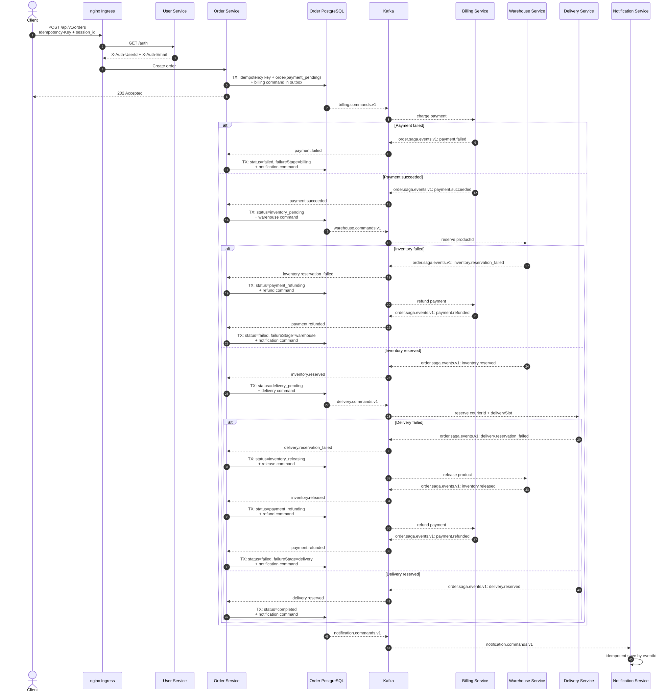

# otus-microservices-homework-08-09

## Домашнее задание 08

### Распределенные транзакции

#### Цель

В этом ДЗ вы научитесь реализовывать распределенную транзакцию.

---

### Описание / Пошаговая инструкция выполнения домашнего задания

#### Вариант 1 (С КОДОМ)

Сценарий для интернет-магазина.

Необходимо реализовать сервисы:

* **Биллинг**;
* **Склад**;
* **Доставка**.

Для сервиса **«Заказ»** в рамках метода **«создание заказа»** необходимо реализовать механизм распределенной транзакции:

* на основе **Saga**;
* или на основе **двухфазного коммита (2PC)**.

#### Во время создания заказа необходимо

1. В сервисе **«Биллинг»** убедиться, что платеж прошел.
2. В сервисе **«Склад»** зарезервировать конкретный товар на складе.
3. В сервисе **«Доставка»** зарезервировать курьера на конкретный слот времени.

Если хотя бы один из пунктов выполнить не удалось, необходимо **откатить все остальные изменения**.

---

### На выходе должно быть

#### 0) Описание паттерна

Описать, какой паттерн использовался для реализации распределенной транзакции.

#### 1) Команда установки приложения

Предоставить команду установки приложения:

* из Helm;
* или из Kubernetes-манифестов.

Обязательно указать:

* в каком **namespace** необходимо устанавливать приложение;
* команду создания namespace, если это важно для сервиса.

#### 2) Тесты в Postman

Необходимо предоставить тесты в **Postman**.

#### В тестах обязательно

* использование домена `arch.homework` в качестве **initial value** переменной `{{baseUrl}}`.

## Домашнее задание 09

### Идемпотентность и коммутативность API в HTTP и очередях

#### Цель

В этом ДЗ вы создадите сервис **«Заказ»** (или научитесь использовать сервис из прошлого занятия) и для одного из его методов, например **«создание заказа»**, сделаете его идемпотентным.

---

### Описание / Пошаговая инструкция выполнения домашнего задания

#### Вариант 1 (С КОДОМ)

На выходе должно быть:

#### 0) Описание паттерна

Описание того, какой паттерн для реализации идемпотентности использовался.

#### 1) Команда установки приложения

Предоставить команду установки приложения:

* из Helm;
* или из Kubernetes-манифестов.

Обязательно указать:

* в каком **namespace** необходимо устанавливать приложение;
* команду создания namespace, если это важно для сервиса.

#### 2) Тесты в Postman

Необходимо предоставить тесты в **Postman**.

#### В тестах обязательно

* использование домена `arch.homework` в качестве **initial value** переменной `{{baseUrl}}`.


## Архитектурное решение

Выбран и реализован гибридный вариант: **синхронное HTTP-взаимодействие с Billing Service и асинхронная отправка нотификаций через Kafka**.

Система состоит из четырех самостоятельных Go-сервисов с отдельными Go modules, Docker-образами и PostgreSQL:

* `user-service` хранит пользователей и серверные сессии. После создания пользователя синхронно и идемпотентно вызывает Billing Service для создания счета;
* `billing-service` владеет счетами, балансами и операциями. Денежные значения передаются целыми числами в минимальных денежных единицах;
* `order-service` создает заказ, синхронно вызывает Billing Service для оплаты и сохраняет итоговый статус `paid` или `rejected`;
* `notification-service` получает события из Kafka и сохраняет email-сообщения в своей БД. Фактическая отправка email по условию задания не выполняется.

Каждый прикладной сервис запущен в двух репликах. Kafka-топик `notification.commands.v1` имеет две партиции. Обе реплики Notification Service входят в consumer group `notification-service-v1`, поэтому при штатной работе каждая читает одну партицию, а при отказе одной реплики оставшаяся получает обе партиции после rebalance.

При создании заказа Order Service сохраняет заказ со статусом `payment_pending` и запускает оркестрируемую сагу через Kafka. Успешный заказ проходит Billing, Warehouse и Delivery и завершается статусом `completed`. При отказе сохраняются `failureStage` (`billing`, `warehouse` или `delivery`) и `failureReason`; после необходимых компенсаций заказ завершается статусом `failed`. Для каждого финального результата Order Service публикует `notification.commands.v1` с Kafka key, равным `orderId`: письмо об успехе либо отдельное сообщение об ошибке соответствующего этапа.

Notification Service фиксирует Kafka offset только после успешного сохранения сообщения. Доставка имеет семантику at-least-once, поэтому `eventId` используется как primary key, а повторная запись выполняется через `ON CONFLICT DO NOTHING`.

Входящий трафик обслуживает nginx Ingress на домене `arch.homework`. Для защищенных маршрутов Ingress проверяет cookie `session_id` через `GET /auth` и передает сервисам доверенные заголовки `X-Auth-UserId`, `X-Auth-Email` и `X-Auth-Roles`.

### Схема системы



Исходник: [architecture.mmd](./docs/architecture.mmd).

### Создание заказа: Kafka Saga + уведомления о результате



Исходник: [sequence-http-kafka.mmd](./docs/sequence-http-kafka.mmd).

### IDL-контракты

HTTP API описано в OpenAPI:

* [User Service OpenAPI](./services/user-service/docs/swagger.yaml) — регистрация, авторизация и API пользователей;
* [Order Service OpenAPI](./services/order-service/docs/swagger.yaml) — `POST /api/v1/orders` и чтение заказов;
* [Billing Service OpenAPI](./services/billing-service/docs/swagger.yaml) — создание счета, пополнение, снятие и внутренний `POST /internal/v1/payments`;
* [Notification Service OpenAPI](./services/notification-service/docs/swagger.yaml) — `GET /api/v1/notifications`.

Асинхронный контракт описан в [AsyncAPI](./docs/asyncapi.yaml): топик `notification.commands.v1`, Kafka key `orderId`, producer `order-service`, consumer `notification-service`, consumer group `notification-service-v1`.


## Сборка и публикация
Каждый сервис со своим Go module and Dockerfile

Test:
```powershell
go test ./services/user-service/... ./services/billing-service/... ./services/order-service/... ./services/warehouse-service/... ./services/delivery-service/... ./services/notification-service/... ./internal/platform/...
```

Build:
```powershell
docker build --platform linux/amd64 -f services/user-service/Dockerfile -t paulrozhkin/otus-microservices-homework-08-09-user-service:latest .
docker build --platform linux/amd64 -f services/billing-service/Dockerfile -t paulrozhkin/otus-microservices-homework-08-09-billing-service:latest .
docker build --platform linux/amd64 -f services/order-service/Dockerfile -t paulrozhkin/otus-microservices-homework-08-09-order-service:latest .
docker build --platform linux/amd64 -f services/warehouse-service/Dockerfile -t paulrozhkin/otus-microservices-homework-08-09-warehouse-service:latest .
docker build --platform linux/amd64 -f services/delivery-service/Dockerfile -t paulrozhkin/otus-microservices-homework-08-09-delivery-service:latest .
docker build --platform linux/amd64 -f services/notification-service/Dockerfile -t paulrozhkin/otus-microservices-homework-08-09-notification-service:latest .
```

Push:
```powershell
docker push paulrozhkin/otus-microservices-homework-08-09-user-service:latest
docker push paulrozhkin/otus-microservices-homework-08-09-billing-service:latest
docker push paulrozhkin/otus-microservices-homework-08-09-order-service:latest
docker push paulrozhkin/otus-microservices-homework-08-09-warehouse-service:latest
docker push paulrozhkin/otus-microservices-homework-08-09-delivery-service:latest
docker push paulrozhkin/otus-microservices-homework-08-09-notification-service:latest
```


## Minikube 
1. Запуска minikube с заданными ресурсами:
```
minikube start --cpus=6 --memory=8192
```

## Работа с helm
1. Переходим в helm дирректорию:
```aiignore
cd ./deployment/helm/online-store
```
2. Добавляем репозитории:
```aiignore
helm repo add ingress-nginx https://kubernetes.github.io/ingress-nginx
helm repo add prometheus-community https://prometheus-community.github.io/helm-charts
helm repo add grafana https://grafana.github.io/helm-charts
helm repo add grafana-community https://grafana-community.github.io/helm-charts
helm repo update
```
3. Устанавливаем мониторинг:
```aiignore
helm upgrade --install kube-prometheus-stack prometheus-community/kube-prometheus-stack `
  -n monitoring `
  --create-namespace `
  --set prometheus.prometheusSpec.serviceMonitorSelectorNilUsesHelmValues=false `
  --set prometheus.prometheusSpec.podMonitorSelectorNilUsesHelmValues=false `
  --set grafana.adminPassword=admin `
  --set grafana.sidecar.dashboards.enabled=true `
  --set grafana.sidecar.dashboards.label=grafana_dashboard `
  --set grafana.sidecar.dashboards.searchNamespace=monitoring `
  --set grafana.sidecar.alerts.enabled=true `
  --set grafana.sidecar.alerts.label=grafana_alert `
  --set grafana.sidecar.alerts.searchNamespace=monitoring `
  --set grafana.sidecar.datasources.enabled=true `
  --set grafana.sidecar.datasources.label=grafana_datasource `
  --set grafana.sidecar.datasources.searchNamespace=monitoring `
  --set prometheus.prometheusSpec.retention=2h `
  --set prometheus.prometheusSpec.resources.requests.memory=512Mi `
  --set prometheus.prometheusSpec.resources.limits.memory=1Gi `
  --set grafana.resources.requests.memory=128Mi `
  --set grafana.resources.limits.memory=512Mi
```
4. Устанавливаем Loki и Alloy:
```aiignore
helm upgrade --install loki grafana-community/loki `
  -n monitoring `
  --create-namespace `
  -f ../observability/loki-values.yaml `
  --wait

helm upgrade --install alloy grafana/alloy `
  -n monitoring `
  -f ../observability/alloy-values.yaml `
  --wait
```
5. Для доступа к стеку мониторинга следовать инструкциями из возврата предыдущей команды.
    Нужно прокинуть доступ до Grafana через инструкции "Access Grafana local instance". Дубликат возврата:
```aiignore
Get Grafana 'admin' user password by running:

  kubectl --namespace monitoring get secrets kube-prometheus-stack-grafana -o jsonpath="{.data.admin-password}" | base64 -d ; echo

Access Grafana local instance:

  export POD_NAME=$(kubectl --namespace monitoring get pod -l "app.kubernetes.io/name=grafana,app.kubernetes.io/instance=kube-prometheus-stack" -oname)
  kubectl --namespace monitoring port-forward $POD_NAME 3000

Get your grafana admin user password by running:

  kubectl get secret --namespace monitoring -l app.kubernetes.io/component=admin-secret -o jsonpath="{.items[0].data.admin-password}" | base64 --decode ; echo


Visit https://github.com/prometheus-operator/kube-prometheus for instructions on how to create & configure Alertmanager and Prometheus instances using the Operator.
```
6. Подтягиваем зависимости и устанавливаем chart:
```aiignore
helm dependency build .
  
helm upgrade --install online-store . `
  -n online-store `
  --create-namespace `
  --timeout 15m `
  --wait `
  --wait-for-jobs
```

При старте API и migration jobs повторяют подключение к PostgreSQL до истечения `database.startupTimeout` (по умолчанию в Helm `60s`) с интервалом `database.retryInterval` (`1s`). Параметры передаются в сервисы как `<SERVICE_PREFIX>_DB_STARTUP_TIMEOUT` и `<SERVICE_PREFIX>_DB_RETRY_INTERVAL`. `startupProbe` даёт приложению до 90 секунд на запуск и не позволяет liveness probe перезапустить контейнер во время ожидания БД.

Проверка ресурсов мониторинга:
```aiignore
kubectl -n online-store get servicemonitors
kubectl -n monitoring get configmap -l grafana_dashboard=1
kubectl -n monitoring get configmap -l grafana_alert=1
kubectl -n monitoring get configmap -l grafana_datasource=1
```
В Grafana открыть dashboard `Online Store Logs` или `Explore -> Loki`. Для поиска конкретного HTTP-сбоя использовать значение `X-Request-ID` из ответа.

7. Если minikube запущен с driver=docker, то выполнить тунелирование:
```aiignore
minikube tunnel
```
8. Выполнить postman тест:
```aiignore
newman run ./../../../tests/OTUS-homework-08-09.postman_collection.json `
  --reporters cli `
  --verbose `
  --bail
```

## Работа с docker compose для разработки

1. Переходим в docker compose дирректорию:
```aiignore
cd ./deployment/docker-compose
```

2. Запускаем БД и kafka
```aiignore
docker compose `
  -f deployment/docker-compose/docker-compose.yaml `
  up -d `
  kafka-init `
  kafka-ui `
  user-postgres `
  billing-postgres `
  order-postgres `
  notification-postgres `
  warehouse-postgres `
  delivery-postgres
```
3. Выполняем миграции данных:
```aiigonore
go run ./services/user-service/cmd/api migrate
go run ./services/billing-service/cmd/api migrate
go run ./services/order-service/cmd/api migrate
go run ./services/warehouse-service/cmd/api migrate
go run ./services/delivery-service/cmd/api migrate
go run ./services/notification-service/cmd/api migrate
```
4. Запускаем микросервисы в любом удобном режиме. Рекомендуется Compound run configuration in GoLand IDE
